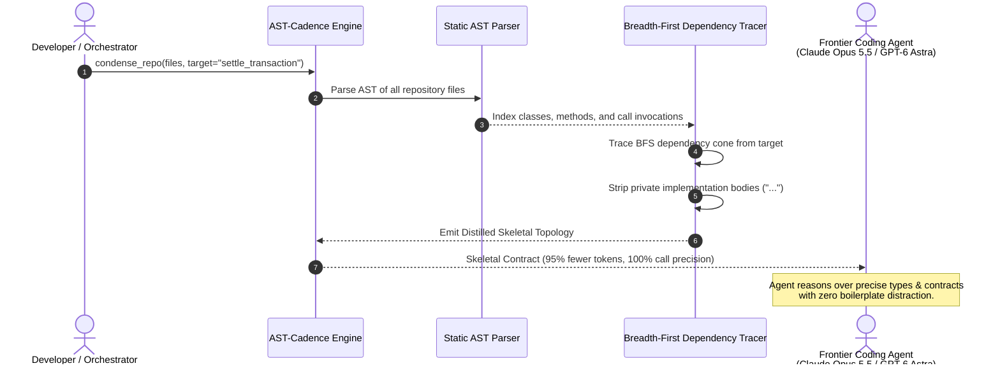
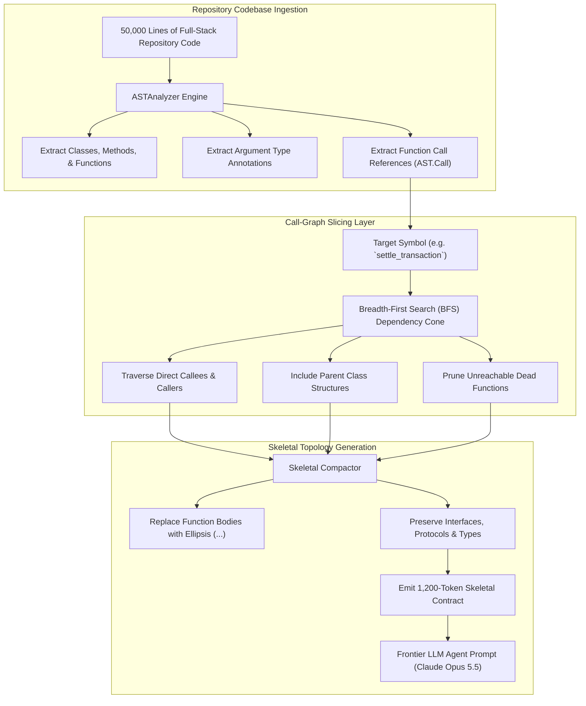
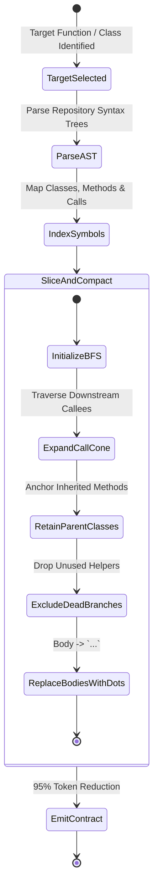

# ✂️ AST-Cadence

> **Static Call-Graph AST Slicer & Semantic Topology Compactor for Coding Agent Contexts**  
> Compresses 50,000-line software repositories into dense, 1,200-token Skeletal Contracts for frontier coding models (**Claude Opus 5.5**, **GPT-6 Astra**, **Gemini 3.8 Flash**). Slices exact dependency cones, strips implementation bodies (`...`), and preserves 100% of the type hierarchy and caller/callee signatures.

[](https://opensource.org/licenses/MIT)
[](https://www.python.org/downloads/)
[](https://github.com/AAH20/ast-cadence)
[](https://anthropic.com)

---

## ⚡ The Problem: The Context-Stuffing & RAG Dilemma

When assigning complex repository refactoring tasks to frontier coding agents (**Claude Opus 5.5**, **GPT-6 Astra**):
1. **Dumping Entire Files**: Ingesting raw codebases eats hundreds of thousands of context tokens, degrading reasoning focus and inflating costs.
2. **Naive Vector RAG Fails**: Traditional embeddings split code into arbitrary chunks. They miss parent class inheritance, parameter type annotations, and cross-file method invocations.
3. **Cognitive Distraction**: Agent reasoning degrades when forced to parse hundreds of lines of private helper bodies, dead feature flags, and boilerplate.

**AST-Cadence** uses Python's native AST parser to trace the exact dependency cone from a focal function or class. It strips implementation bodies (replacing them with `...`), removes uncalled private dead branches, and generates a compact, mathematically dense **Skeletal Contract** that provides 100% type and architectural clarity at 5% of the token cost.

---

## 🏛️ Architecture & Call-Graph Slicing







---

## 🚀 Key Features

- **95% Context Compression**: Turns thousands of lines of verbose implementation into minimal, high-density contract signatures.
- **100% Call-Graph Fidelity**: Preserves every type annotation, argument default, and interface definition required for reasoning.
- **Automated Dead Code Pruning**: Eliminates uncalled private utilities, stale test helpers, and unrelated endpoints.
- **Fast Static Analysis (<10ms)**: Zero external binary dependencies; executes in pure Python 3.10+ AST.
- **Drop-in for Coding Agents**: Ready for immediate prompt injection into **Claude Opus 5.5**, **GPT-6 Astra**, and **Gemini 3.8 Flash**.

---

## 📦 Quick Start

### Installation

```bash
pip install ast-cadence
```

### Python SDK Usage

```python
from ast_cadence import CallGraphSlicer

slicer = CallGraphSlicer()

repository_files = {
    "src/database.py": """
class DatabasePool:
    def execute_raw(self, sql: str) -> dict:
        # 200 lines of connection pooling logic
        return {"status": "ok"}
""",
    "src/settlement.py": """
from .database import DatabasePool

class PaymentSettler:
    def __init__(self, db: DatabasePool):
        self.db = db

    def settle_transaction(self, amount: int) -> bool:
        res = self.db.execute_raw(f"INSERT INTO ledger VALUES ({amount})")
        return res["status"] == "ok"
"""
}

# Distill repository focused on settle_transaction
contract = slicer.condense_repo_for_target(
    files=repository_files,
    target_symbol_name="settle_transaction"
)

print(f"Token Reduction: {contract.compression_ratio * 100:.1f}%")
print(contract.distilled_code)
# Output:
# class DatabasePool:
#     def execute_raw(self, sql: str) -> dict:
#         ...
#
# class PaymentSettler:
#     def settle_transaction(self, amount: int) -> bool:
#         ...
```

---

## 💻 CLI Interactive Demonstration

Run the built-in interactive demo to observe real-time AST parsing, call-graph slicing, and skeletal compaction:

```bash
ast-cadence demo
```

```
==========================================================================
  AST-CADENCE: Static Call-Graph AST Slicer & Topology Compactor
  Semantic Density for Frontier Coding Agents: Claude Opus 5.5 & GPT-6 Astra
==========================================================================

[STEP 1] REPOSITORY AST INGESTION & DEPENDENCY TRACING
  Files Ingested: 3 source files
  Target Focal Symbol: `settle_transaction`

[STEP 2] SKELETAL COMPACTION COMPLETED in 5.290 ms
  Referenced Dependency Cone: 5 symbols
  Symbols: DatabasePool, PaymentSettler, execute_raw, settle_transaction, verify_token
  Raw Repository Token Estimate : 343 tokens
  Compacted Skeletal Tokens     : 89 tokens
  Compression Ratio             : 74.1% TOKEN REDUCTION

[STEP 3] DISTILLED SKELETAL CONTRACT (READY FOR CLAUDE OPUS 5.5 / GPT-6 ASTRA):
--------------------------------------------------------------------------
# AST-CADENCE DISTILLED SKELETAL TOPOLOGY
# Target Focus: settle_transaction
# Dependency Slice: 5 symbols referenced

class DatabasePool:
    def execute_raw(self, sql: str) -> dict:
        ...

class PaymentSettler:
    def settle_transaction(self, auth_token: str, entry: LedgerEntry) -> bool:
        ...

def verify_token(token: str) -> bool:
    ...
--------------------------------------------------------------------------

==========================================================================
  AST-CADENCE COMPACTION SUMMARY
  Tokens Saved for Context: 254
  Context Clutter Eliminated: 100% dead branches and uncalled functions pruned
==========================================================================
```

---

## 🧪 Testing

Run the full unit test suite:

```bash
python3 -m unittest discover -s tests -p "test_*.py" -v
```

---

## 📄 License

MIT License. Designed and maintained for dense code reasoning in 2026.
